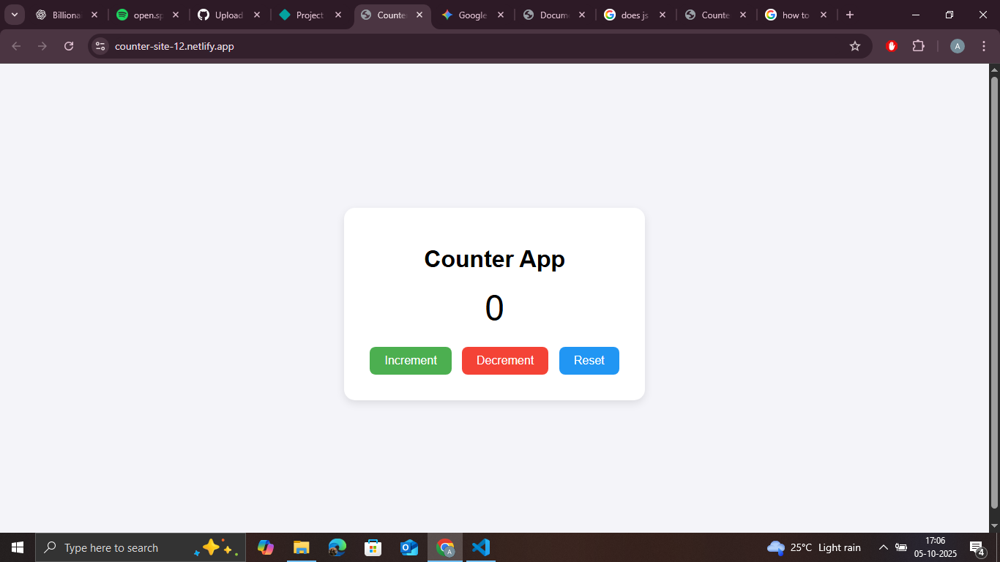

# 🧮 Counter App

A simple and interactive counter built using **HTML, CSS, and JavaScript**.  
Users can increase, decrease, and reset the count, and the app remembers the last value using **localStorage**.

## 🌟 Features
- Increment, decrement, and reset buttons  
- Saves value even after refreshing the page  
- Clean and minimal UI  

## 🧰 Tech Stack
- HTML  
- CSS  
- JavaScript  

## 🚀 Live Demo
[👉 View on Netlify](https://counter-site-12.netlify.app/)

## 📸 Screenshot

